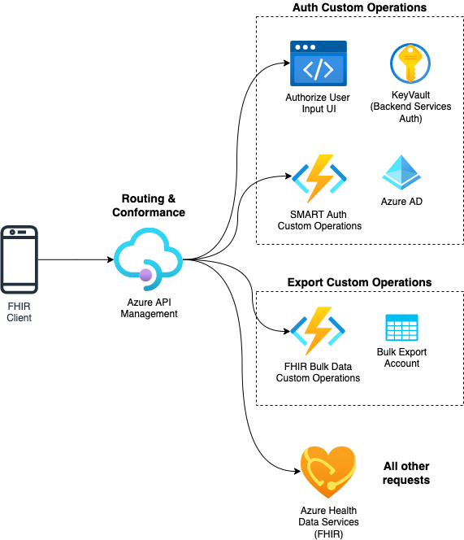

# Azure ONC (g)(10) SMART on FHIR Sample

This sample demonstrates how Azure Health Data Services can be used to pass the Inferno test for ONC (g)(10) compliance, using Azure Active Directory as the identity provider. While Azure Health Data Services is the core of this sample, some custom code and routing is required to fully meet the requirements, especially around Azure Active Directory. This sample is therefore *not* using only the FHIR Server but other Azure Services with sample code to pass the Inferno tests. You can use this sample as a starting point for building your application and solution to pass the ONC (g)(10) testing requirements.

This sample is using Azure Active Directory as the identity provider. If you have your own identity provider, you will need to build a custom solution around that instead.

If you are using the open source FHIR Server, you will also need to build a custom solution around that instead.

This sample is targeted for EHR vendors who are looking to pass ONC (g)(10)

## Components

The following components are deployed with this sample. For more details of how the pieces work together, check out [the technical guide](./docs/technical-guide.md).

- Azure Health Data Services FHIR Service
- Azure API Management
- Azure Active Directory
- Azure Functions
- Azure Storage
- Azure Application Insights

## Sample Deployment

Deployment of this sample requires the creation of supporting Azure services, custom code deployed to Azure Function Apps, and setup in Azure Active Directory. For detailed deployment instructions, check out the [Deployment Document here](./docs/deployment.md).

## Next steps

- Integration of these com
- APIM Developer portal
- Private networking

## Sample Support

If you have questions about this sample, please submit a Github issue. This sample is custom code you must adapt to your own environment and is not supported outside of Github issues.